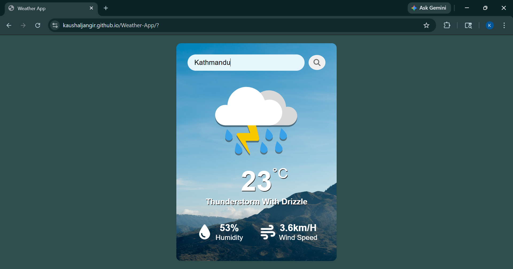

# 🌦️ Weather App

A simple and responsive Weather App built using HTML, CSS, and JavaScript.
The app fetches real-time weather data using a weather API and displays useful weather information with dynamic weather icons.

---

## 🚀 Features

* Search weather by city name
* Displays temperature in Celsius
* Shows weather condition and description
* Displays humidity and wind speed
* Dynamic weather icons based on weather type
* Responsive and modern UI design

---

## 🛠️ Technologies Used

* HTML
* CSS
* JavaScript
* OpenWeather API

---

## 📸 Screenshot

---

## 🔗 Live Demo

[https://kaushaljangir.github.io/Weather-App/?]

---

## 📌 How to Run

1. Download or clone the repository
2. Open `index.html` in your browser

---

## 🎯 Project Purpose

This project was built to practice JavaScript concepts like API fetching, async/await, DOM manipulation, event handling, and working with real-time data while improving frontend UI skills.

---

## 👨‍💻 Author

**Kaushal Jangir**
